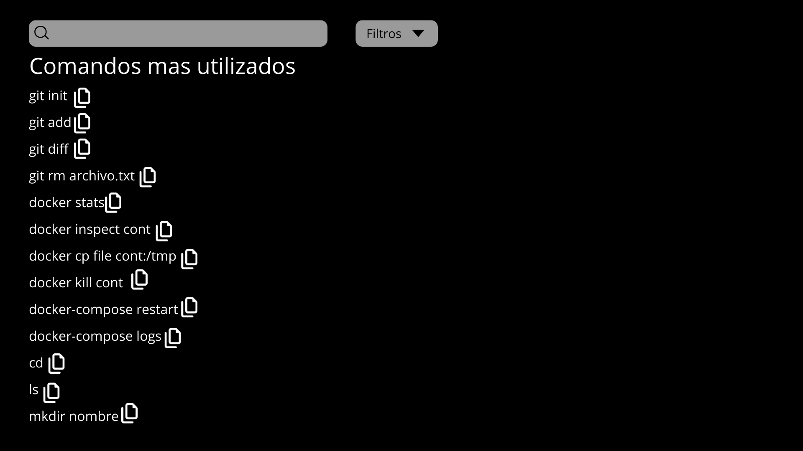

# Reto-ODS4-WebSostenible

# Proyecto Web: [Nombre de vuestra App Web] - ODS 4

Este proyecto es una propuesta tecnológica para mejorar la calidad educativa (ODS 4) desde la
perspectiva del Desarrollo de Aplicaciones Web (DAW).

## 1. Análisis del Problema y Sostenibilidad (Responsable: Julia Garcia Torices)

### El "Bug" Educativo
> En 1º de DAW, el inicio del curso es caótico debido a la gran cantidad de comandos de terminal (Linux, Git, SQL) que debemos memorizar. [cite_start]Muchos compañeros se quedan atrás o pierden tiempo buscando en apuntes dispersos, lo que genera una brecha en el ritmo de aprendizaje y afecta a la calidad educativa (ODS 4).
### Nuestro "Parche" Sostenible
- [ ] Medida 1: Implementación de Modo Oscuro nativo para ahorro de energía en dispositivos.
- [ ] Medida 2: Optimización de carga (imágenes ligeras y código minificado) para reducir el consumo de datos y mejorar la accesibilidad en conexiones lentas.

## 2. Arquitectura de la Solución Web (Responsable: Javier Castro López)

### Funcionalidades Principales

1. **Buscador de Comandos:** [Es un buscador simple al que tu le describes el comando y el te devuelve comandos que cumplan con la descripción enviada]
2. **Clasificación por Módulos:** [Cada comando tiene sus etiquetas relacionadas con su lenguaje y su función, permitiéndole a los usuarios filtrar por etiquetas]
3. **Botón de Copiado Rápido:** [Cada comando tiene a su derecha un icono el cual, al hacerle click, te copia el comando en el portapapeles]

### Entidades de Datos Básicas

| Entidad  | Descripción                               | Ejemplo de datos                |
| :------- | :---------------------------------------- | :------------------------------ |
| Usuarios | Almacena profesores y alumnos             | Email, contraseña, rol          |
| Comandos | Almacena los comandos que registra la web | git add, docker ps, npm run dev |

### Prototipo de Interfaz (Frontend)

A continuación se muestra el wireframe de nuestra aplicación:

**Breve explicación:** En la captura podemos ver 2 barras, una de busqueda por texto, y otra por filtros. A su vez, vemos los comandos mas utilizados. Al pinchar en ellos, nos saldrá su descripcion, y al clickear el icono de su derecha, se nos copiara el comando en el portapapeles
# Proyecto Web: 1º Daw CheatSheet - ODS 4
Este proyecto es una propuesta tecnológica para mejorar la calidad educativa (ODS 4) desde la
perspectiva del Desarrollo de Aplicaciones Web (DAW).

